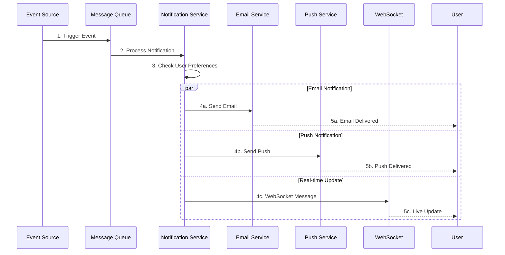
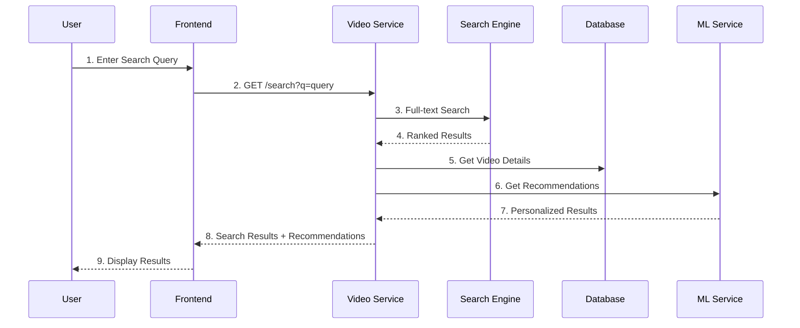
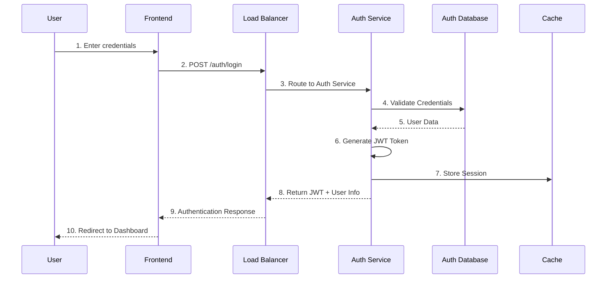
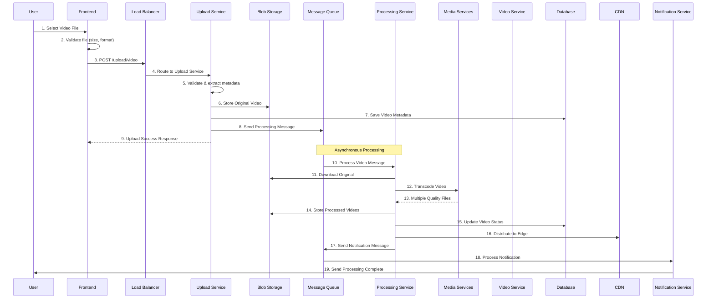
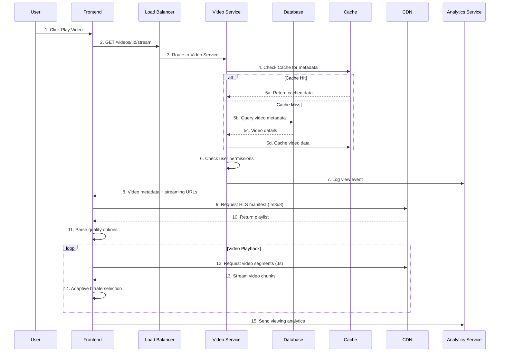

# ClipSync - High Level Design (HLD) Diagram

## 🏗️ System Architecture Overview

```mermaid
graph TB
    subgraph "Client Layer"
        UI[📱 React Frontend<br/>- Authentication UI<br/>- Video Upload<br/>- Video Player<br/>- User Dashboard]
        Mobile[📱 Mobile App<br/>(Future)]
    end

    subgraph "API Gateway / Load Balancer"
        LB[🔄 Azure Application Gateway<br/>- Load Balancing<br/>- SSL Termination<br/>- Request Routing]
    end

    subgraph "Authentication & Authorization"
        Auth[🔐 Auth Service<br/>- JWT Token Management<br/>- User Registration<br/>- Login/Logout<br/>- Password Reset]
        AuthDB[(🗄️ User Database<br/>PostgreSQL)]
    end

    subgraph "Core Services"
        UserSvc[👥 User Service<br/>- Profile Management<br/>- User Settings<br/>- Social Features]
        
        UploadSvc[📤 Upload Service<br/>- Video File Upload<br/>- File Validation<br/>- Metadata Extraction<br/>- Azure Blob Storage]
        
        ProcessSvc[⚙️ Processing Service<br/>- Video Transcoding<br/>- HLS Stream Generation<br/>- Thumbnail Creation<br/>- Quality Optimization]
        
        VideoSvc[📹 Video Service<br/>- Video Metadata<br/>- Search & Discovery<br/>- Recommendations<br/>- Analytics]
        
        NotifSvc[🔔 Notification Service<br/>- Email Notifications<br/>- Push Notifications<br/>- Real-time Updates]
    end

    subgraph "Data Layer"
        MainDB[(🗄️ Main Database<br/>PostgreSQL<br/>- Video Metadata<br/>- User Data<br/>- Comments)]
        
        Cache[(⚡ Redis Cache<br/>- Session Storage<br/>- Video Metadata<br/>- User Preferences)]
        
        BlobStorage[(☁️ Azure Blob Storage<br/>- Original Videos<br/>- Processed Videos<br/>- Thumbnails<br/>- Static Assets)]
        
        CDN[🌐 Azure CDN<br/>- Video Streaming<br/>- Global Distribution<br/>- Edge Caching]
    end

    subgraph "Message Queue & Events"
        Queue[📨 Azure Service Bus<br/>- Video Processing Queue<br/>- Notification Queue<br/>- Event Streaming]
    end

    subgraph "External Services"
        Email[📧 SendGrid<br/>Email Service]
        
        Analytics[📊 Application Insights<br/>- Performance Monitoring<br/>- Error Tracking<br/>- Usage Analytics]
        
        MediaServices[🎬 Azure Media Services<br/>- Advanced Transcoding<br/>- Live Streaming<br/>- DRM Protection]
    end

    subgraph "Infrastructure & DevOps"
        K8s[☸️ Azure Kubernetes Service<br/>- Container Orchestration<br/>- Auto Scaling<br/>- Service Discovery]
        
        Monitor[📈 Azure Monitor<br/>- Health Checks<br/>- Performance Metrics<br/>- Alerting]
        
        CICD[🔄 GitHub Actions<br/>- CI/CD Pipeline<br/>- Automated Testing<br/>- Deployment]
    end

    %% Client Connections
    UI --> LB
    Mobile --> LB
    
    %% Load Balancer to Services
    LB --> Auth
    LB --> UserSvc
    LB --> UploadSvc
    LB --> VideoSvc
    
    %% Service Dependencies
    Auth --> AuthDB
    UserSvc --> MainDB
    UserSvc --> Cache
    
    UploadSvc --> BlobStorage
    UploadSvc --> Queue
    UploadSvc --> MainDB
    
    ProcessSvc --> Queue
    ProcessSvc --> BlobStorage
    ProcessSvc --> MediaServices
    ProcessSvc --> MainDB
    
    VideoSvc --> MainDB
    VideoSvc --> Cache
    VideoSvc --> CDN
    
    NotifSvc --> Queue
    NotifSvc --> Email
    
    %% Infrastructure
    K8s --> Auth
    K8s --> UserSvc
    K8s --> UploadSvc
    K8s --> ProcessSvc
    K8s --> VideoSvc
    K8s --> NotifSvc
    
    Monitor --> K8s
    CICD --> K8s
    Analytics --> K8s

    %% Styling
    classDef clientLayer fill:#e1f5fe,stroke:#01579b,stroke-width:2px
    classDef serviceLayer fill:#f3e5f5,stroke:#4a148c,stroke-width:2px
    classDef dataLayer fill:#e8f5e8,stroke:#1b5e20,stroke-width:2px
    classDef infraLayer fill:#fff3e0,stroke:#e65100,stroke-width:2px
    
    class UI,Mobile clientLayer
    class Auth,UserSvc,UploadSvc,ProcessSvc,VideoSvc,NotifSvc serviceLayer
    class MainDB,AuthDB,Cache,BlobStorage,CDN dataLayer
    class K8s,Monitor,CICD,Analytics infraLayer
```

### 4. Additional System Flows

#### 🔔 Notification Flow


#### 🔍 Search & Discovery Flow


## 🔄 Data Flow Diagrams

### 1. User Authentication Flow



#### 📋 Authentication Flow Explanation:

**Step 1-2: User Initiates Login**
- User enters email/password in the React frontend
- Frontend validates input format and sends POST request to `/auth/login`
- Request includes user credentials and device information

**Step 3: Load Balancer Routing**
- Azure Application Gateway receives the request
- Performs SSL termination and security checks
- Routes request to available Auth Service instance

**Step 4-5: Credential Validation**
- Auth Service receives login request
- Queries PostgreSQL database to find user by email
- Compares hashed password using bcrypt
- Validates account status (active, verified, not locked)

**Step 6: Token Generation**
- Auth Service generates JWT token with user claims
- Token includes: user ID, email, roles, expiration time
- Signs token with secret key for verification

**Step 7: Session Storage**
- Stores session information in Redis cache
- Includes: user ID, login time, device info, IP address
- Sets TTL for automatic session expiry

**Step 8-10: Response & Redirect**
- Returns JWT token and user profile data
- Frontend stores token in secure HTTP-only cookie
- Redirects user to dashboard with authenticated state

#### 🔒 Security Features:
- Password hashing with bcrypt (salt rounds: 12)
- JWT tokens with short expiration (15 minutes)
- Refresh token mechanism for seamless UX
- Rate limiting to prevent brute force attacks
- Account lockout after failed attempts

### 2. Video Upload & Processing Flow



#### 📹 Video Upload & Processing Flow Explanation:

**Phase 1: Upload (Steps 1-9)**

**Step 1-2: File Selection & Client Validation**
- User selects video file through drag-drop or file picker
- Frontend validates file before upload:
  - File size (max 2GB)
  - Format (MP4, MOV, AVI, MKV)
  - Duration (max 2 hours)
- Shows upload preview with metadata

**Step 3-4: Upload Initiation**
- Frontend creates multipart upload request
- Includes authentication token and file metadata
- Load balancer routes to available Upload Service instance

**Step 5: Server-side Validation**
- Upload Service performs comprehensive validation:
  - File integrity check (MD5 hash)
  - Virus scanning
  - Content policy validation
  - User storage quota check
- Extracts metadata: duration, resolution, codec, bitrate

**Step 6: Blob Storage**
- Uploads original file to Azure Blob Storage
- Uses hierarchical storage structure: `/videos/{userId}/{videoId}/original/`
- Implements resumable upload for large files
- Generates unique blob URLs for security

**Step 7: Database Entry**
- Creates video record in PostgreSQL with status: "UPLOADED"
- Stores metadata: title, description, file path, size, duration
- Associates with user account and sets privacy settings

**Step 8-9: Queue & Response**
- Sends processing message to Azure Service Bus queue
- Returns upload success with tracking ID to frontend
- User can monitor processing status in real-time

**Phase 2: Processing (Steps 10-19)**

**Step 10-11: Processing Initiation**
- Processing Service polls message queue
- Downloads original video from Blob Storage
- Validates file integrity before processing

**Step 12-13: Video Transcoding**
- Azure Media Services transcodes video to multiple formats:
  - 1080p (H.264, 5 Mbps)
  - 720p (H.264, 3 Mbps)
  - 480p (H.264, 1.5 Mbps)
  - 360p (H.264, 800 Kbps)
- Generates HLS playlist (.m3u8) and segments (.ts)
- Creates thumbnail images at 5-second intervals

**Step 14: Storage of Processed Files**
- Stores all quality variants in Blob Storage
- Organized structure: `/videos/{userId}/{videoId}/{quality}/`
- Compressed files reduce storage costs by 60-70%

**Step 15: Database Update**
- Updates video status to "PROCESSED"
- Stores streaming URLs for each quality
- Updates duration, file sizes, and processing metrics

**Step 16: CDN Distribution**
- Uploads processed files to Azure CDN
- Distributes to global edge locations
- Enables low-latency streaming worldwide

**Step 17-19: Notification**
- Sends completion message to notification queue
- Notification Service sends email/push notification
- User receives processing complete notification with video link

#### ⚡ Performance Optimizations:
- **Chunked Upload**: Files uploaded in 5MB chunks for reliability
- **Parallel Processing**: Multiple quality variants processed simultaneously
- **Smart Compression**: Adaptive bitrate based on content analysis
- **CDN Preloading**: Popular content pre-cached at edge locations

### 3. Video Streaming Flow



#### 🎬 Video Streaming Flow Explanation:

**Phase 1: Video Request & Authorization (Steps 1-8)**

**Step 1-2: User Initiates Playback**
- User clicks play button on video thumbnail
- Frontend sends request to get streaming information
- Request includes video ID and current user authentication

**Step 3: Load Balancing**
- Azure Application Gateway routes to Video Service
- Uses round-robin with health checks
- Handles SSL termination and request validation

**Step 4-5: Metadata Retrieval with Caching**
- **Cache Hit Path (5a)**: Redis returns cached video metadata instantly
- **Cache Miss Path (5b-5d)**: 
  - Query PostgreSQL database for video details
  - Retrieve: title, duration, available qualities, thumbnails
  - Cache data in Redis with 1-hour TTL

**Step 6: Permission Validation**
- Checks if video is public or private
- Validates user access rights for private videos
- Verifies video processing status (must be "PROCESSED")
- Handles geo-restrictions if applicable

**Step 7: Analytics Logging**
- Records view initiation event
- Captures: user ID, video ID, timestamp, device info
- Used for recommendation engine and analytics dashboard

**Step 8: Response with Streaming URLs**
- Returns video metadata and streaming endpoints
- Includes available quality levels (360p, 480p, 720p, 1080p)
- Provides CDN URLs for optimal performance

**Phase 2: HLS Streaming (Steps 9-14)**

**Step 9-10: Manifest Request**
- Frontend requests HLS master playlist (.m3u8)
- CDN returns manifest with available quality streams
- Manifest includes bandwidth requirements for each quality

**Step 11: Quality Selection**
- Video player parses available quality options
- Selects initial quality based on:
  - Network speed detection
  - Device capabilities
  - User preferences

**Step 12-14: Adaptive Streaming**
- **Segment Requests**: Player requests 2-10 second video segments
- **CDN Delivery**: Edge servers deliver cached segments
- **Adaptive Bitrate**: Player automatically adjusts quality based on:
  - Network conditions
  - Buffer health
  - CPU usage

**Phase 3: Analytics & Monitoring (Step 15)**

**Step 15: Viewing Analytics**
- Continuous reporting of playback metrics:
  - Play/pause events
  - Seek positions
  - Quality changes
  - Buffering events
  - Completion percentage

#### 🌐 CDN & Performance Features:

**Global Edge Caching**
- Video segments cached at 150+ global locations
- 95% cache hit ratio for popular content
- Automatic cache warming for trending videos

**Adaptive Bitrate Streaming (ABR)**
- Seamless quality switching during playback
- Buffer-based adaptation algorithm
- Supports 4K, 1080p, 720p, 480p, 360p qualities

**Network Optimization**
- HTTP/2 for multiplexed segment delivery
- Prefetching of next segments
- Bandwidth detection and optimization

#### 📊 Real-time Metrics:
- **Startup Time**: < 2 seconds for video initialization
- **Buffering Ratio**: < 1% for good connections
- **Quality Adaptation**: Smooth transitions within 5 seconds
- **Global Latency**: < 100ms to nearest CDN edge

## 🔄 Flow Integration & System Orchestration

### 📈 Complete User Journey
The three main flows work together to provide a seamless user experience:

1. **Authentication Flow** → Establishes secure user session
2. **Upload & Processing Flow** → Enables content creation and optimization
3. **Streaming Flow** → Delivers optimized content globally

### 🎯 Cross-Flow Dependencies

#### Authentication Integration
- **Upload Flow**: Requires valid JWT token for file upload authorization
- **Streaming Flow**: Uses authentication for access control and personalization
- **All APIs**: Protected endpoints validate JWT tokens before processing

#### Data Consistency
- **Upload → Processing**: Queue ensures reliable async processing
- **Processing → Streaming**: Database updates trigger CDN cache invalidation
- **Cross-Service**: Event-driven architecture maintains data consistency

#### Performance Optimization
- **Shared Caching**: Redis cache shared across all services
- **CDN Integration**: Both upload (thumbnails) and streaming use same CDN
- **Analytics Pipeline**: All flows contribute to unified analytics system

### 🚨 Error Handling & Recovery

#### Upload Flow Failures
- **Network Issues**: Resumable uploads with chunk retry logic
- **Processing Failures**: Automatic retry with exponential backoff
- **Storage Issues**: Fallback to secondary storage regions

#### Streaming Flow Failures
- **CDN Outages**: Automatic failover to origin servers
- **Quality Issues**: Graceful degradation to lower bitrates
- **Playback Errors**: Client-side retry with error reporting

#### Authentication Flow Failures
- **Token Expiry**: Seamless refresh token mechanism
- **Service Outages**: Circuit breaker pattern with fallback
- **Invalid Sessions**: Automatic logout with user notification

### 📊 Monitoring & Observability

#### Flow-Specific Metrics
- **Authentication**: Login success rate, token validation time
- **Upload**: Upload success rate, processing time, queue depth
- **Streaming**: Startup time, buffering events, CDN hit ratio

#### End-to-End Tracing
- **Request IDs**: Unique identifiers track requests across services
- **Distributed Tracing**: OpenTelemetry for complete request visibility
- **Performance Monitoring**: Application Insights for bottleneck identification

### 🔄 Scalability Patterns

#### Horizontal Scaling
- **Stateless Services**: All microservices designed for horizontal scaling
- **Load Distribution**: Azure Application Gateway distributes traffic
- **Database Scaling**: Read replicas for query optimization

#### Auto-Scaling Triggers
- **CPU Usage**: > 70% for 5 minutes
- **Memory Usage**: > 80% for 3 minutes
- **Queue Depth**: > 1000 messages
- **Response Time**: > 500ms for 95th percentile

## 🏛️ System Components

### Frontend Layer
- **React Application**: Single Page Application with responsive design
- **Authentication**: JWT-based authentication with automatic token refresh
- **Video Player**: HLS video player with adaptive bitrate streaming
- **File Upload**: Chunked upload with progress tracking and resume capability
- **Real-time Updates**: WebSocket connections for live notifications

### API Gateway
- **Azure Application Gateway**: Central entry point for all client requests
- **SSL Termination**: Handles HTTPS encryption/decryption
- **Rate Limiting**: Protects services from abuse
- **Request Routing**: Routes requests to appropriate microservices

### Microservices
1. **Authentication Service**
   - JWT token generation and validation
   - Password hashing and security
   - OAuth integration (Google, GitHub)
   - Session management

2. **User Service**
   - User profile management
   - Settings and preferences
   - Social features (following, likes)
   - User analytics

3. **Upload Service**
   - Multi-part file upload handling
   - File validation and virus scanning
   - Metadata extraction
   - Storage management

4. **Processing Service**
   - Video transcoding (multiple resolutions)
   - HLS stream generation
   - Thumbnail creation
   - Quality optimization

5. **Video Service**
   - Video catalog management
   - Search and filtering
   - Recommendation engine
   - View analytics

6. **Notification Service**
   - Email notifications
   - Push notifications
   - Real-time event broadcasting
   - Notification preferences

### Data Storage
- **PostgreSQL**: Primary database for structured data
- **Redis**: Caching layer and session storage
- **Azure Blob Storage**: Object storage for video files
- **Azure CDN**: Global content delivery network

### Infrastructure
- **Azure Kubernetes Service**: Container orchestration
- **Azure Monitor**: Application monitoring and alerting
- **Azure Service Bus**: Message queuing system
- **GitHub Actions**: CI/CD pipeline

## 📊 Scalability Features

### Horizontal Scaling
- Stateless microservices design
- Load balancer distribution
- Auto-scaling based on metrics
- Database read replicas

### Performance Optimization
- CDN for global content delivery
- Redis caching layer
- Optimized database queries
- Lazy loading and pagination

### Reliability
- Health checks and monitoring
- Circuit breaker patterns
- Retry mechanisms
- Graceful error handling

## 🔒 Security Features

### Authentication & Authorization
- JWT-based authentication
- Role-based access control (RBAC)
- OAuth integration
- Multi-factor authentication

### Data Protection
- Data encryption at rest and in transit
- GDPR compliance
- Regular security audits
- Secure file upload validation

### Infrastructure Security
- Network isolation
- Secret management
- Regular security patches
- DDoS protection

## 🚀 Future Enhancements

### Phase 2 Features
- Live streaming capabilities
- Mobile applications (iOS/Android)
- Advanced analytics dashboard
- AI-powered content moderation

### Phase 3 Features
- Multi-tenant support
- Advanced collaboration features
- API marketplace
- Machine learning recommendations

## 📈 Performance Metrics

### Target SLAs
- **Uptime**: 99.9%
- **API Response Time**: < 200ms (95th percentile)
- **Video Upload**: < 30 seconds for 1GB file
- **Video Processing**: < 5 minutes for 1 hour video
- **CDN Delivery**: < 100ms first byte

### Monitoring KPIs
- Request throughput (RPS)
- Error rates by service
- Database query performance
- Storage utilization
- User engagement metrics

---

*This HLD provides a comprehensive overview of the ClipSync architecture, designed for scalability, reliability, and performance.*
